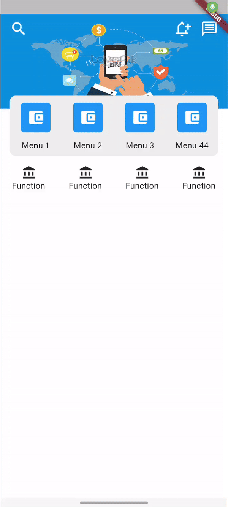

# Coordinator Menu Widget
Have you ever seen the ui/ux menu of e-wallet applications ? This library will cover that for you
## Demo



## Understand layout

## Usage
To use this plugin, add `coordinator_menu` as a [dependency in your pubspec.yaml file](https://flutter.dev/docs/development/platform-integration/platform-channels).

### Basic

```dart
CoordinatorMenuWidget(
    headerView: _getHeaderView(),
    bgHeaderView: _getBgHeaderView(),
    bg: _getBg(),
    colorBgChange: Colors.white,
    containerMenuView: _getContainerView(),
    bgMenu: _getBgMenu(),
    menus: _getMenus(),
    listTitle: _getTitle(),
    paddingMenu: const EdgeInsets.symmetric(horizontal: 16.0, vertical: 12.0),
    functionView: _getListFunction(),
    paddingCollapseMenu: const EdgeInsets.fromLTRB(62, 8, 108, 8),
),
```